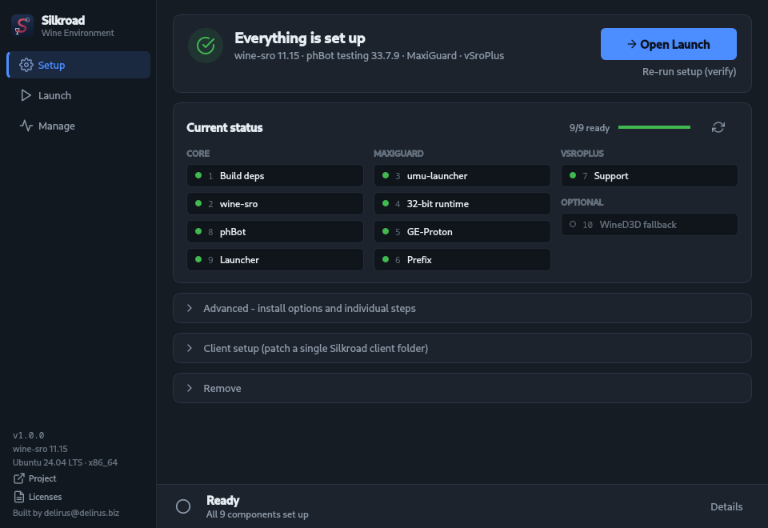

<p align="center">
  
</p>

<h1 align="center">SilkroadWineEnvironment</h1>

<p align="center">
  Play <b>Silkroad Online</b> and run <b>phBot</b> on Linux - one app sets up everything Wine needs, then starts your clients with a click.
</p>

<p align="center">
  <a href="https://github.com/RealDelirus/SilkroadWineEnvironment/releases/latest"><b>Download the latest release</b></a>
  &nbsp;·&nbsp;
  <a href="docs/guide.md"><b>User guide</b></a>
  &nbsp;·&nbsp;
  <a href="#troubleshooting">Troubleshooting</a>
</p>



## What it does

SilkroadWineEnvironment is a **one-click installer for Linux** whose main job
is getting **phBot** running. phBot is Windows-only, and getting it to work
under Wine by hand means building the right Wine, setting up prefixes,
installing the Visual C++ runtime and making each client type start under
Wine at all. The app does all of that for you:

1. **Click Install.** The app installs the build tools it needs, builds its own
   Wine and prepares everything phBot and your clients need.
2. **phBot comes along automatically.** You pick the channel and components
   (phBot, phBot Manager, plugins, navmesh, minimap), accept phBot's terms, and
   the app downloads it straight from ProjectHax.
3. **Start botting.** Add your client folders, then start phBot, the phBot
   Manager and your clients from the **Launch** page, or from desktop
   shortcuts.

It works with plain clients as well as clients protected by **vSroPlus** or
**MaxiGuard**, and sets up the matching environment for each of them.

> **Compatibility only.** SilkroadWineEnvironment exists to make Silkroad
> clients and phBot run on Linux the way they already run on Windows. It does
> not bypass any restrictions, gives no in-game advantage and is neither meant
> nor suited for cheating.

Everything is installed privately under your home folder. Your system's own
Wine (if any) is never touched, and running the setup again only fills in
whatever is still missing.

## Get started

1. **Download** `SilkroadWineEnvironment-x86_64.AppImage` from the
   [latest release](https://github.com/RealDelirus/SilkroadWineEnvironment/releases/latest).
2. **Make it executable and start it:**
   ```bash
   chmod +x SilkroadWineEnvironment-x86_64.AppImage
   ./SilkroadWineEnvironment-x86_64.AppImage
   ```
   (Or right-click it → *Properties* → *Allow executing as program*, then double-click.)
3. **Click Install** on the Setup page. The first run builds Wine and takes
   **20-60 minutes**. After that, add your client folders on the **Launch** page
   and start playing.

The [user guide](docs/guide.md) walks through every page with screenshots.

## Supported systems

- Any **x86_64** Linux with **glibc 2.31 or newer**. Tested on Ubuntu 20.04,
  22.04 and 24.04, Debian Bullseye and Bookworm (including **ChromeOS Flex /
  Crostini**), Fedora and Arch.
- An X11 desktop, or Wayland with XWayland (the default almost everywhere).
- A package manager the app knows: **apt, pacman, dnf or zypper**. It uses it
  to install the tools needed to build Wine.
- About **4 GB** of free disk space.

## Troubleshooting

| Problem | Fix |
|---|---|
| `fuse: failed to exec fusermount` / *Cannot mount AppImage* | Install FUSE (`sudo apt install fuse3`), or start it with `./SilkroadWineEnvironment-x86_64.AppImage --appimage-extract-and-run` |
| *needs an X11 display* | Enable XWayland, or log into an X11 session |
| An install step failed | Click **Details** in the bottom bar for the full output, fix the cause, then click **Continue install**. Finished steps are skipped. |
| A client starts but shows a black screen or closes right away (VMs) | Setup → Advanced → **10. Toggle: force WineD3D** |

More in the guide: [Troubleshooting](docs/guide.md#troubleshooting).

## Without the GUI

Everything the app does is also available in the terminal:

```bash
./swe.sh            # guided setup (the same installer the app uses)
./swe.sh --help     # all options for scripted / unattended installs
~/.local/share/sro-linux/sro.sh    # terminal control panel to start and stop clients
```

See [Using the terminal](docs/guide.md#using-the-terminal-instead) in the guide.

## Uninstall

In the app: **Setup → Remove → Uninstall everything**. By hand:

```bash
rm -rf ~/.local/share/sro-linux ~/.cache/sro-linux
```

## For developers

The GUI (`gui/`, PySide6) is a thin front end. All install and launch logic
lives in the shell scripts, which work on their own too:

```
swe.sh                     installer / orchestrator
lib/common.sh              distro, package and path helpers
lib/build-wine-sro.sh      builds the private Wine tree
lib/setup-prefix.sh        Wine prefixes and per-client setup
lib/phbot-fetch.py         downloads phBot (+ Manager, plugins, navmesh, minimap) from ProjectHax's CDN
lib/sro-launcher.sh        control panel, installed as sro.sh (+ headless --start-*/--list-json flags)
patches/                   source-level Wine patches
src/, prebuilt/            small native shims and bundled fallback assets
gui/                       the GUI that gets packaged into the AppImage
build-appimage.sh          builds the AppImage
tests/smoke-appimage.sh    starts the AppImage on every target distro
tools/screenshots.py       regenerates docs/images/ from the real GUI
```

- **Build the AppImage:** `./build-appimage.sh --docker`. It builds in an
  Ubuntu 20.04 container on purpose (glibc 2.31) so the result runs on older
  distros too. The comments in the script explain why.
- **Test it on all target distros:** `tests/smoke-appimage.sh` (needs docker
  or podman).
- **Refresh the screenshots** after UI changes:
  `python3 tools/screenshots.py` (needs PySide6, plus `pyte` for the terminal
  shot). Demo data only, nothing from your own machine ends up in the images.

## License

SilkroadWineEnvironment is free software: you can redistribute and/or modify
it under the terms of the **GNU General Public License, version 3 or later**
(see [LICENSE](LICENSE)).

- The Wine patches in [`patches/`](patches/) and the patched
  `prebuilt/user32.dll` are derived from Wine and licensed, like Wine, under
  the **GNU LGPL, version 2.1 or later** ([patches/COPYING.LGPL-2.1](patches/COPYING.LGPL-2.1)).
- `prebuilt/VC_redist.x86.exe` is Microsoft's Visual C++ Redistributable,
  shipped unmodified under Microsoft's license terms for it. It is only the
  offline fallback: setup installs Microsoft's current one when it can.
- **phBot is not part of this project.** It is downloaded from ProjectHax's
  servers (the same files phBot's own installer fetches) during setup, and
  only after you have accepted its
  [Terms and Conditions](https://phbot.org/en/download/).
- The AppImage bundles Python, Qt/PySide6 and a few system libraries. Their
  licenses are listed in the app under **Licenses** (bottom of the sidebar).

## Disclaimer

This is an independent community project. It is not affiliated with or
endorsed by Joymax, any Silkroad Online server, or ProjectHax (phBot). Its only
purpose is Linux compatibility: it does not bypass any restrictions and is not
made or suitable for cheating. Using bots or running protected clients may
break a server's rules - check them, it's your account. The software comes
**without any warranty**, see the license.

---

<p align="center">Built by <b>delirus@delirus.biz</b></p>
