# SilkroadWineEnvironment – User guide

This guide walks through the app page by page: installing everything, adding
your Silkroad clients, starting them together with phBot, and what to do when
something goes wrong.

**Contents**

1. [Before you start](#before-you-start)
2. [Starting the app](#starting-the-app)
3. [The window at a glance](#the-window-at-a-glance)
4. [First-time setup](#first-time-setup)
5. [The Setup page after installing](#the-setup-page-after-installing)
6. [Advanced options](#advanced-options)
7. [Adding your clients](#adding-your-clients)
8. [Starting phBot, the Manager and your clients](#starting-phbot-the-manager-and-your-clients)
9. [Desktop and menu shortcuts](#desktop-and-menu-shortcuts)
10. [Seeing and stopping what's running](#seeing-and-stopping-whats-running)
11. [Updates](#updates)
12. [Removing things](#removing-things)
13. [Using the terminal instead](#using-the-terminal-instead)
14. [Troubleshooting](#troubleshooting)
15. [Where everything lives](#where-everything-lives)

---

## Before you start

You need:

- A 64-bit Linux with **glibc 2.31 or newer**: Ubuntu 20.04+, Debian Bullseye+,
  ChromeOS Flex / Crostini, Fedora, Arch, and most others.
- An X11 desktop, or Wayland with XWayland. XWayland is on by default in GNOME,
  KDE and most other desktops.
- About **4 GB** of free disk space and, for the first install, **20-60 minutes**.
  Most of that is building Wine.
- Your **password** (sudo) once, so the app can install the tools it needs to
  build Wine.
- Your Silkroad client folder(s). The app doesn't download game clients.

You **don't** need Wine, Steam or Proton installed. The app brings its own
private copies and never changes your system's Wine.

## Starting the app

1. Download `SilkroadWineEnvironment-x86_64.AppImage` from the
   [latest release](https://github.com/RealDelirus/SilkroadWineEnvironment/releases/latest).
2. Make it executable, either in a terminal:
   ```bash
   chmod +x SilkroadWineEnvironment-x86_64.AppImage
   ./SilkroadWineEnvironment-x86_64.AppImage
   ```
   or in your file manager: right-click → *Properties* → *Allow executing as
   program*, then double-click it.

The AppImage is the whole app. There is nothing to install. You can keep it
anywhere, e.g. in `~/Applications`.

> **"Cannot mount AppImage" / "fuse: failed to exec fusermount"?** Your system
> has no FUSE. Install it (`sudo apt install fuse3`), or start the app with
> `./SilkroadWineEnvironment-x86_64.AppImage --appimage-extract-and-run`.

## The window at a glance


- **Sidebar (left):** the three pages.
  - **Setup** installs and checks the environment.
  - **Launch** starts phBot, the phBot Manager and your clients.
  - **Manage** shows and stops what's running.
- **Status bar (bottom):** what the app is doing right now. During an install
  it shows two progress bars (the whole run and the current step) plus the
  elapsed time. **Details** opens the full output log.
- **Info (bottom left):** the app version, the installed Wine version, your
  system, a link to the project, **Licenses** (this app's license and those of
  everything bundled with it), and a notice when a newer version is out
  (see [Updates](#updates)).

The window can be made smaller. On a narrow window the sidebar shrinks to
icons only.

## First-time setup

When nothing is installed yet, the Setup page looks like this:

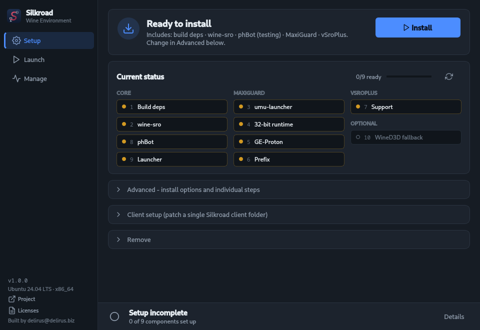

The card at the top says what the next **Install** will include: build tools,
`wine-sro` (the private Wine), phBot, and support for MaxiGuard and vSroPlus
clients. Click **Install**.

### phBot options

Before phBot is downloaded, a window asks what to install, the same choices
phBot's own installer offers:

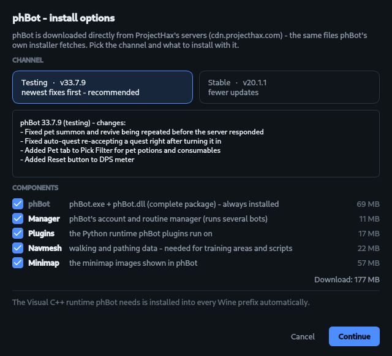

- **Channel:** *Testing* gets phBot's fixes first and is the default,
  *Stable* updates less often. Each shows its current version, and the box
  below it shows that version's changelog.
- **Components:** phBot itself (`phBot.exe` + `phBot.dll`, the complete
  package) is always installed. **Manager**, **Plugins** (the Python runtime
  plugins need), **Navmesh** (walking/pathing data) and **Minimap** are
  optional and all on by default. The sizes show what will be downloaded.
- phBot comes straight from ProjectHax's servers (`cdn.projecthax.com`), the
  same files phBot's installer would download. Downloads are kept in
  `~/.cache/sro-linux/phbot`, so a reinstall only downloads what changed.
- The Visual C++ runtime phBot needs is not an option: it is installed into
  **every** Wine environment the app creates, always the current version from
  Microsoft (if that can't be reached: the one in phBot's package, then the
  one bundled with the app).

### phBot's Terms and Conditions

phBot is third-party software by ProjectHax LLC. It is downloaded from
ProjectHax's servers during the install, not shipped with this app. Before it
is downloaded, the app shows phBot's current Terms and Conditions, the same
ones phbot.org's download page asks you to accept:

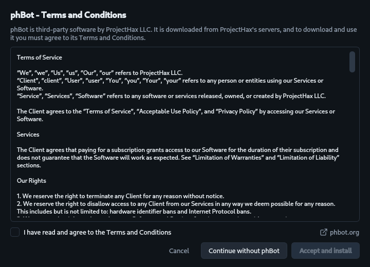

- Tick **I have read and agree to the Terms and Conditions**, then click
  **Accept and install**.
- **Continue without phBot** installs everything else. You can add phBot later
  with **Continue install** or *Advanced → 8. Set up / update phBot*.
- This only appears when phBot actually gets installed, not when it's already
  there.

### Your password

Installing the build tools needs administrator rights, so the app asks for
your password once:

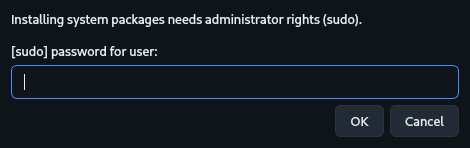

On systems where `sudo` needs no password, such as ChromeOS Crostini, it
doesn't ask at all.

### While it installs

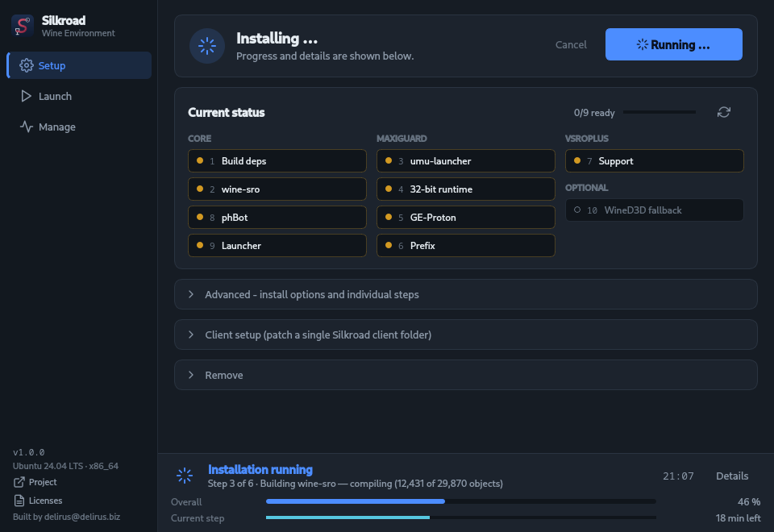

- **Overall** is the whole run. **Current step** is the step shown above the
  bars, with an estimate of the time left for the Wine build. While phBot
  downloads, it shows the file, how much of it has arrived, the download rate
  and the time left:

  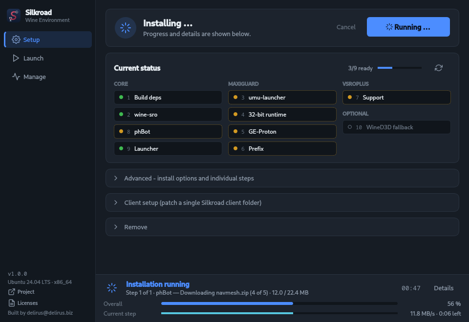
- The tiles under *Current status* turn green one by one as each part is
  finished.
- You can use the Launch and Manage pages in the meantime.
- **Cancel** stops the run. Nothing is lost: a later **Continue install**
  skips everything that's already done. Only a step cut off halfway, such as
  the Wine build, starts over.
- Closing the window during an install asks first, because it would cancel
  the run.

The first run builds Wine from source, which takes **20-60 minutes** depending
on your CPU. After that the Wine build is cached, and later runs take seconds
to minutes.

### If a step fails

The status bar turns red and the output log opens automatically:

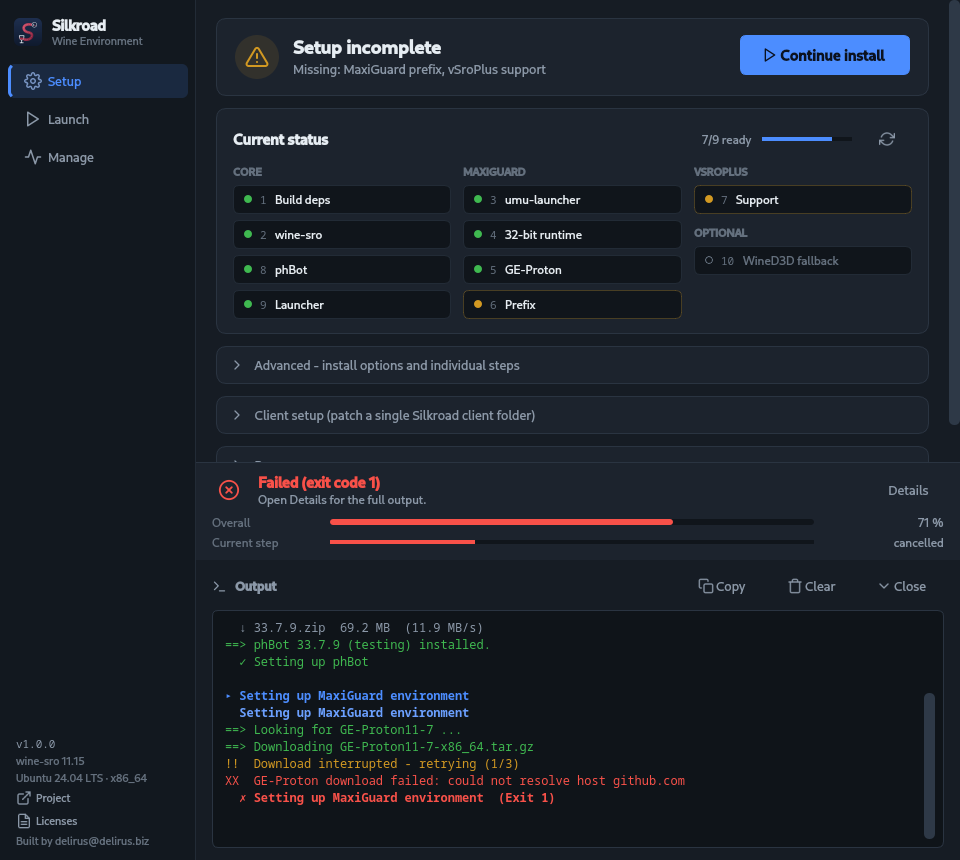

- Lines starting with `XX` are errors, `!!` are warnings.
- **Copy** puts the whole log on the clipboard, which is handy for asking for
  help.
- Fix the cause (in this example: no internet connection), then click
  **Continue install**. It picks up where it stopped.

## The Setup page after installing


- **Everything is set up:** the top card turns green and the main button
  becomes **Open Launch**. **Re-run setup (verify)** goes through all steps
  again and repairs anything that's missing. It never breaks a working setup.
- **Setup incomplete:** something is still missing. The card names what, and
  the button says **Continue install**:

  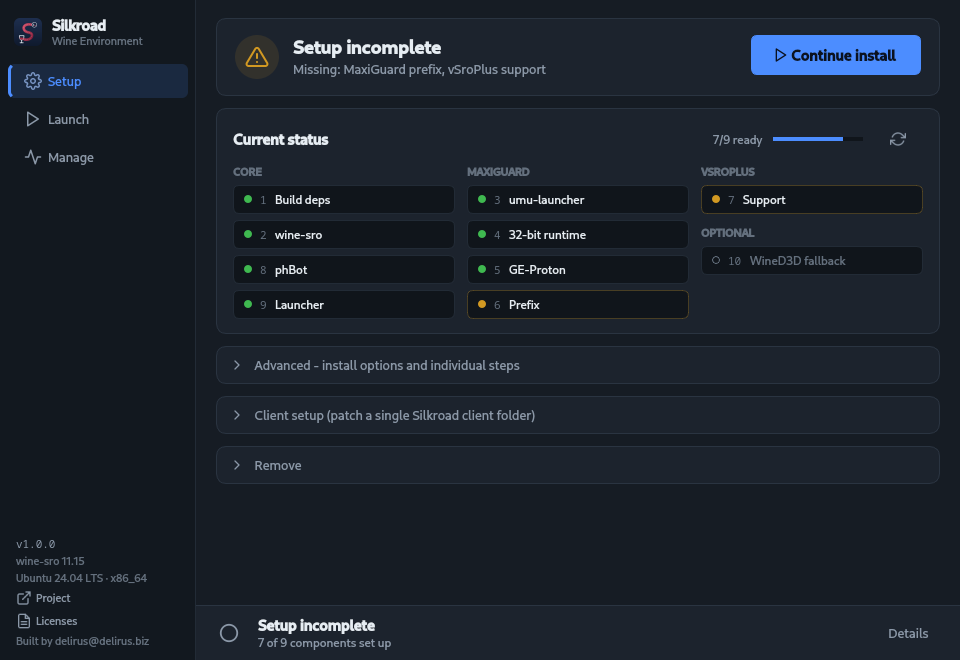

### Current status

Each tile is one part of the environment, grouped by what it belongs to:

| Tile colour | Meaning |
|---|---|
| Green dot | Set up |
| Yellow dot and border | Missing. The next Install / Continue install sets it up. |
| Grey, "not selected" | You turned this option off in Advanced |
| Empty circle | An optional switch that is off (WineD3D, see below) |

- **Core** is always installed.
- **MaxiGuard** and **vSroPlus** are only needed for those client types.
- The small numbers match the buttons under **Advanced**. For example,
  *6. Recreate MaxiGuard prefix* affects tile 6.
- Hover over a tile for its full name. The ↻ button re-checks everything.

## Advanced options

Click **Advanced** to expand it:

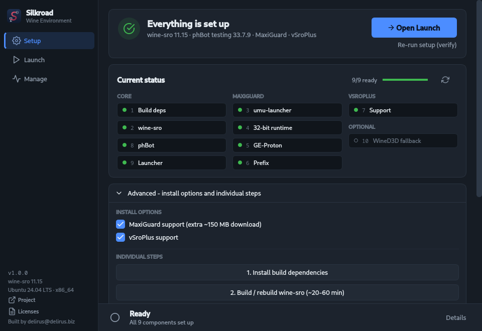

**Install options**

- **MaxiGuard support** and **vSroPlus support** are on by default. Turn one
  off if you never play that client type. MaxiGuard support adds a ~150 MB
  download. The app remembers your choice.

**Individual steps** re-run one part only, for example to repair it. Each
button starts with the number of the tile it affects:

| Button | What it does |
|---|---|
| 1. Install build dependencies | Installs or updates the packages needed to build Wine |
| 2. Build / rebuild wine-sro | Builds the private Wine again (20-60 min) |
| 3-6. Set up MaxiGuard environment | Sets up everything MaxiGuard clients need |
| 6. Recreate MaxiGuard prefix | Deletes and recreates the shared MaxiGuard Wine prefix. Use it if MaxiGuard clients stopped working. |
| 7. Set up vSroPlus support | Sets up what vSroPlus clients need |
| 8. Set up / update phBot | Opens the phBot options, then installs phBot - or, if it is already installed, downloads the chosen channel and components again (an update). Your phBot configs are kept. |
| 10. Toggle: force WineD3D | For virtual machines without working 3D drivers (Vulkan). Try it if clients show a black screen or close right after starting. |

**Client setup** (a separate section below Advanced) prepares a single client
folder and writes a start script into it, so that client can also be started
straight from its folder. You don't need it for the Launch page, see
[Adding your clients](#adding-your-clients).

## Adding your clients

Go to **Launch → Silkroad Client**:

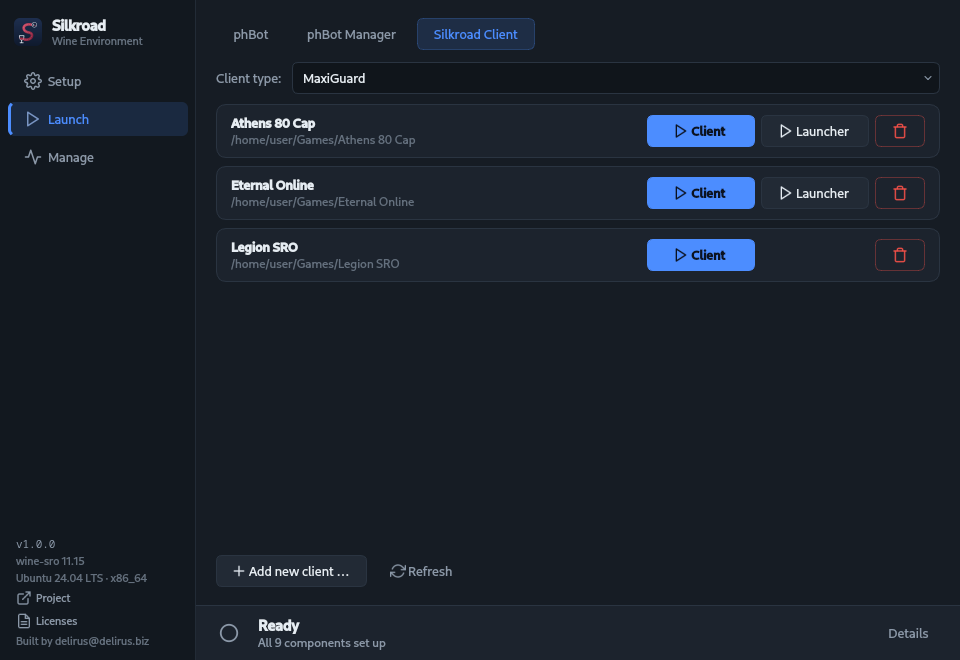

1. Pick the **Client type** at the top. It must match the client's
   protection:

   | If the client folder contains … | choose |
   |---|---|
   | `MaxiGuard.dll` or `Macro_Client.exe` | **MaxiGuard** |
   | `vsroplus_lib.dll` | **vSroPlus** |
   | only `sro_client.exe` / `Silkroad.exe` | **Plain** |

   The list only offers types that are set up. MaxiGuard and vSroPlus appear
   once their support is installed.
2. Click **Add new client …**, choose the client's folder and give it a name.

The client now appears in the list for that type. The 🗑 button removes the
entry from the list. The client's files are not touched.

## Starting phBot, the Manager and your clients

**Your clients** (Launch → Silkroad Client) have up to two buttons each:

- **Client** starts the game client directly.
- **Launcher** starts the client's own launcher (`Silkroad.exe`), e.g. to patch
  the client or log in through it. It only appears if the folder has one.

**phBot** and the **phBot Manager** have their own tabs:

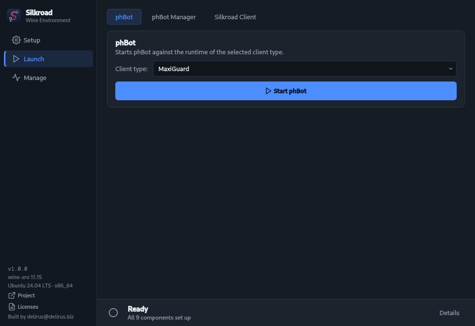

Pick the **Client type** you want to bot on and click **Start phBot**. The type
matters: phBot starts in the same environment as that type's clients, so the
clients it opens run correctly.

- The **phBot Manager** is one of the phBot components (see
  [phBot options](#phbot-options)). If you left it out, add it with
  *Advanced → 8. Set up / update phBot*.
- Everything starts in the background. You can start several clients and bots
  at once, and they keep running when you close the app.

## Desktop and menu shortcuts

Every start action can get its own desktop icon or application-menu entry.
**Right-click** the phBot or phBot Manager card (for the client type currently
selected), or a saved client:

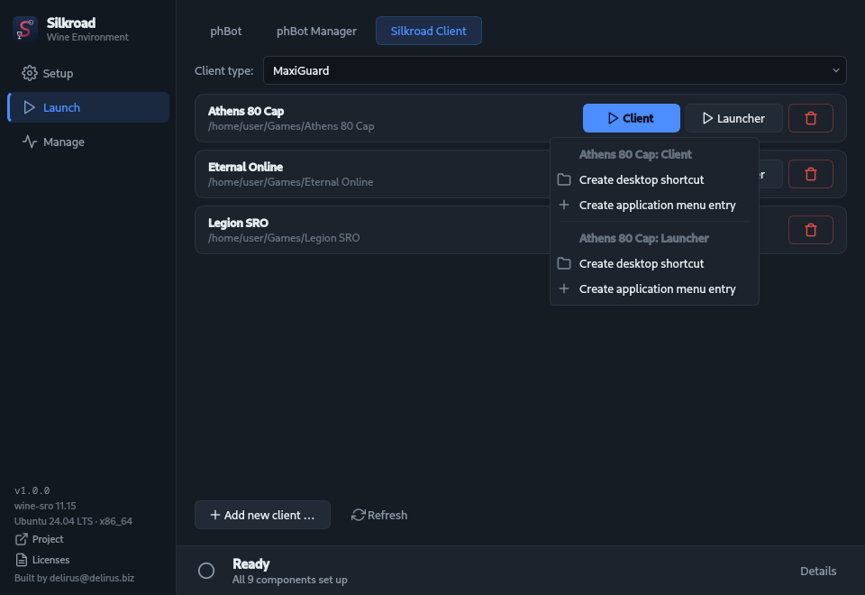

- **Create desktop shortcut** puts an icon on your desktop.
- **Create application menu entry** adds it to your app launcher / start menu.
- The shortcuts use the **program's own icon**, taken from its `.exe`: phBot's
  icon for phBot, the client's icon for the client, and so on.
- They start the program directly. The app itself doesn't need to be open, and
  it doesn't matter where you keep the AppImage.
- Right-click again to **Update** a shortcut (e.g. after moving the AppImage)
  or **Remove** it. *Uninstall everything* removes all of them.

## Seeing and stopping what's running

The **Manage** page lists everything the app started, including what those
programs started themselves:

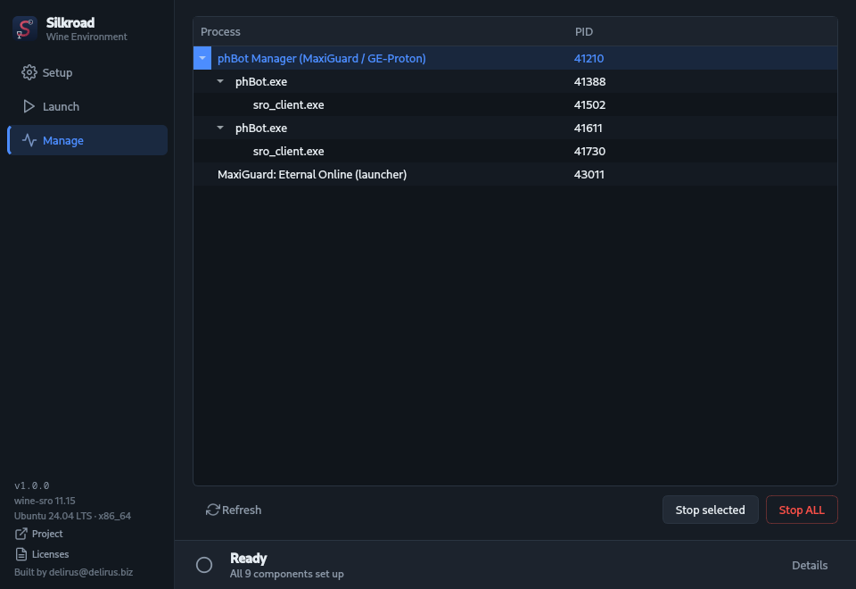

Programs are nested under whatever most likely started them. In this example
a phBot Manager started two phBots, and each of those started a client. The
list refreshes every few seconds.

- **Stop selected** stops the selected program **and everything under it**.
- **Stop ALL** stops everything in the list.

The nesting is inferred (same Wine environment, start order), so with many
similar programs at once it can occasionally group something differently than
expected.

## Updates

When a newer version is published, the info area in the sidebar says so:

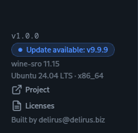

Click the notice to open the release page, download the new AppImage and
start it instead of the old one. Your installation, clients and shortcuts
stay as they are. The app brings its own control-panel script up to date on
first start.

The check runs once per start and only reads the public release list. Set
`SRO_NO_UPDATE_CHECK=1` to turn it off.

## Removing things

Under **Setup → Remove**:

- **Remove MaxiGuard support** removes the MaxiGuard environment (its Wine
  prefix and the patched GE-Proton copy). Your MaxiGuard clients stay in the
  list but won't start until you set MaxiGuard up again.
- **Uninstall everything** removes everything the app installed: Wine, all
  prefixes, phBot, the saved client list and all shortcuts it created. Only the
  Wine build cache (`~/.cache/sro-linux`) is kept, so a reinstall doesn't need
  to download Wine's sources again. Delete that folder too for a completely
  clean system.

Your client folders are never deleted.

## Using the terminal instead

Everything the app does also works without it. Useful over SSH, or if you
prefer the terminal.

**Installing:** get the project files
(`git clone https://github.com/RealDelirus/SilkroadWineEnvironment.git`), then
in that folder run

```bash
./swe.sh            # guided setup: asks for your client folder, then does everything
./swe.sh -y         # the same, with no questions at all
./swe.sh --help     # every option, e.g. --maxiguard / --vsroplus / --phbot / --games DIR
```

Installing phBot asks for the channel and the components, then shows its Terms
and Conditions and asks you to accept them. Unattended runs (`-y`, or no
terminal) never accept them for you: phBot is left out unless you add
`--accept-phbot-terms`, which confirms that you have read and accept them.
The phBot choices as options:

```bash
./swe.sh --skip-deps --skip-wine --phbot --accept-phbot-terms \
         --phbot-channel stable --phbot-components manager,navmesh   # or: all / none
./swe.sh --skip-deps --skip-wine --phbot --phbot-reinstall --accept-phbot-terms   # update phBot
```

**Starting and stopping:** after installing, the control panel lives at
`~/.local/share/sro-linux/sro.sh`:

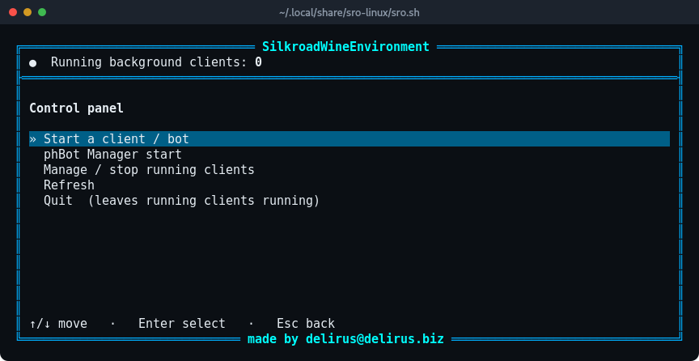

Arrow keys move, Enter selects, Esc goes back. It has the same functions as
the Launch and Manage pages.

For scripts and your own shortcuts, `sro.sh` can also start things directly:

```bash
~/.local/share/sro-linux/sro.sh --start-phbot maxiguard
~/.local/share/sro-linux/sro.sh --start-manager plain
~/.local/share/sro-linux/sro.sh --start-client maxiguard "/path/to/client" client     # or: launcher
~/.local/share/sro-linux/sro.sh --list-json      # what's running
```

## Troubleshooting

**The AppImage doesn't start**

- *"Cannot mount AppImage" / "fuse: failed to exec fusermount":* install FUSE
  (`sudo apt install fuse3`, `sudo dnf install fuse3`, …), or run
  `./SilkroadWineEnvironment-x86_64.AppImage --appimage-extract-and-run`.
- *"needs an X11 display":* you're on Wayland without XWayland. Enable
  XWayland, or log into an X11 session.
- Start it from a terminal to see any error message.

**The password prompt doesn't appear or fails**

- The app first tries passwordless sudo, then its own password dialog, then
  your desktop's password prompt (PolicyKit). If none of them works, your user
  may not be allowed to use `sudo`. Ask your admin, or install the build
  packages yourself and use `./swe.sh --skip-deps`.

**An install step fails**

- Open **Details** (it opens by itself on failure) and look for lines starting
  with `XX`. Common causes: no internet connection, a full disk, or a package
  mirror that's temporarily down.
- Click **Continue install** after fixing it. Finished steps are skipped.

**A client doesn't start or closes right away**

- Check that the **Client type** is right (see
  [Adding your clients](#adding-your-clients)).
- In a virtual machine, or with broken 3D drivers: Setup → Advanced →
  **10. Toggle: force WineD3D**.
- MaxiGuard clients that used to work: Setup → Advanced → **6. Recreate
  MaxiGuard prefix**.
- Each start writes a log to `~/.local/share/sro-linux/run/`. The newest
  `.log` file there usually says why.

**phBot says a newer Visual C++ runtime is required**

- Run Setup → Advanced → **8. Set up / update phBot** again while online. It
  fetches Microsoft's current runtime and installs it into phBot's environment.

**"Manager.exe not found"**

- The Manager was left out when phBot was installed. Run Setup → Advanced →
  **8. Set up / update phBot** and tick **Manager**.

**A desktop shortcut does nothing**

- The program may have moved (e.g. a client folder was renamed). Right-click
  the entry on the Launch page → **Update desktop shortcut**.
- On GNOME you may have to right-click the desktop icon once and choose
  *Allow Launching*.

## Where everything lives

```
~/.local/share/sro-linux/
  wine-sro/          the private Wine the app built
  prefixes/          one Wine environment per client type
  sro.sh             the control panel (see "Using the terminal instead")
  clients.tsv        your saved clients
  icons/             icons taken from your programs for shortcuts
  run/               logs of started programs
  state/             small settings (e.g. force WineD3D)
~/.cache/sro-linux/  Wine source and build cache, phBot downloads, VC++ runtime
```

Shortcuts you create go to your desktop folder and
`~/.local/share/applications/`.
